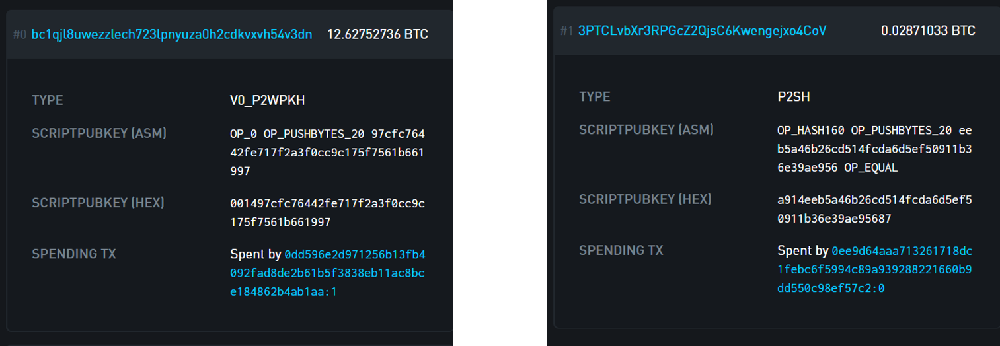
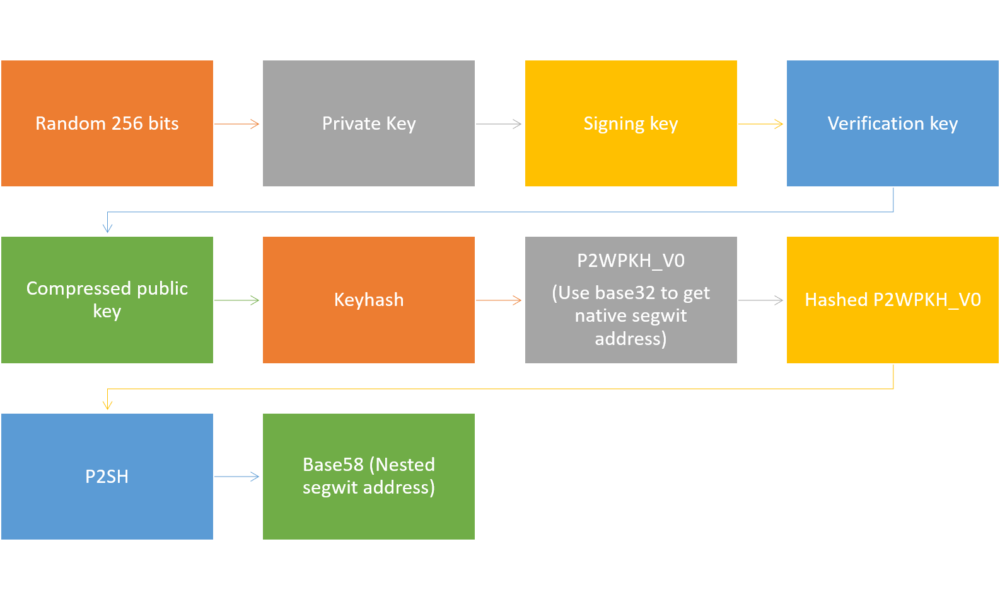
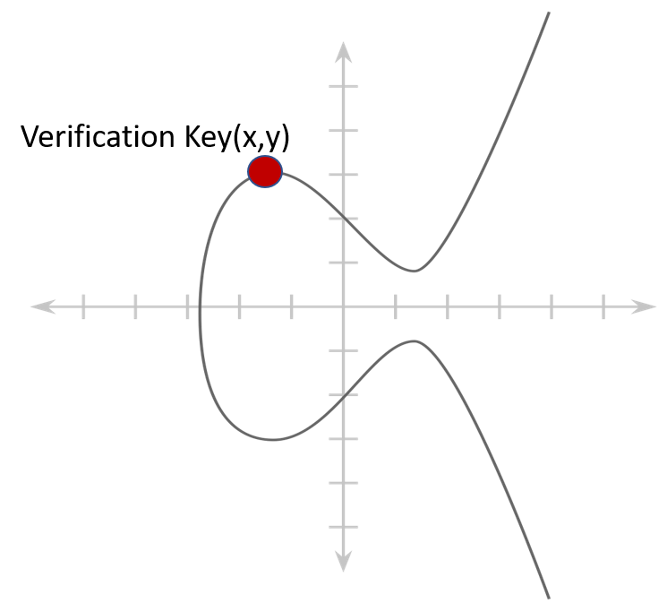
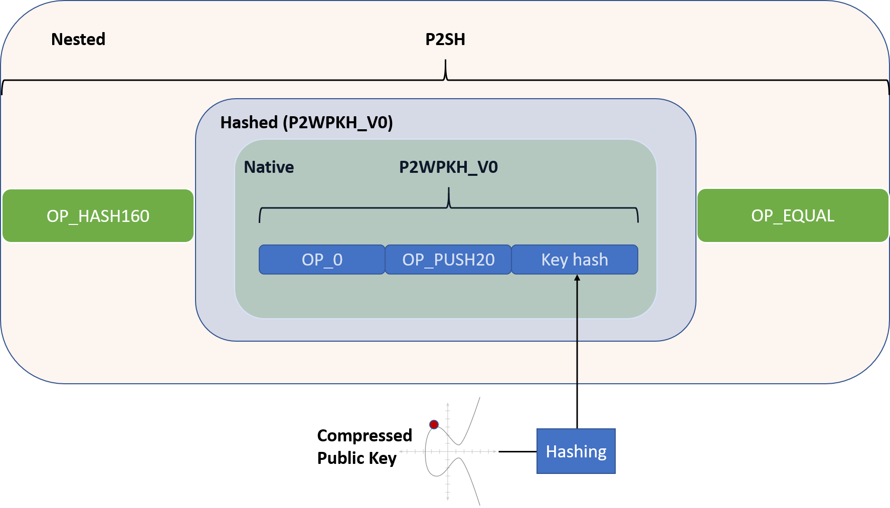

# Segwit Addresses
This tutorial is for educational propuses only. The code uses python 3.6 with the following libraries:
* [ECDSA](https://github.com/warner/python-ecdsa)
* [hashlib](https://docs.python.org/3.6/library/hashlib.html)
* [random](https://docs.python.org/3.6/library/random.html)
* [base58](https://pypi.org/project/base58/)
* [bech32 (Pieter Wuille implementation)](https://github.com/sipa/bech32/tree/master/ref/python)

## General statement about addresses
For every bitcoin transaction, it's the responsibility of the sender to specify the terms by which the coins can be claimed. This terms field is known as the scriptPubKey. Anyone who can prove the (usually) mathematical statement that the sender specified in the scriptPubKey field, can claim the coins from that transaction. However, the sender can't just guess what type of mathematical statements the receiver can verify. It's up to the receiver to provide this information. *The scriptPubKey field in the transaction is provided by the receiver*.
Bitcoin addresses are a way for the receiver to ask the sender, in a more human-friendly manner, to use the receiver's desired scriptPubKey in their transaction.


## The public script
In the case of segwit, we have two types of scripts:
1. Native segwit script, also known as P2WPKH_V0 (Pay To Witness Public Key Hash - Version 0). This script is usually presented in bech32 encoding.
2. Nested segwit script, also known as P2SH-P2WPKH_V0 (Pay To Script Hash - P2WPKH_V0). This script takes the native P2WPKH_V0 script, and place it inside a P2SH script. It's usually presented in Base58 encoding. Both P2SH, as well as Base58 encoding, are backward compatible.

## The process
As we saw earlier, Both native and nested segwit addresses require us to generate a P2WPKH_V0 script. So up until this stage, the process of working on these addresses is the same for both types of addresses. Once we get our P2WPKH_V0 public script, we can either encode it using bech32 encoding => making it into a native bc1 segwit address. Or, we can take the backward compatible route and nest the P2WPKH_V0 script inside a backward compatible P2SH scriptPubKey. After we get our P2SH-P2WPKH_V0 we'll usually encode the addresses using Base58 encoding.


## Genertating the private key
Bitcoin private key is a 256 bits long random number.
```
private_key = (random.getrandbits(256)).to_bytes(32, byteorder="little", signed=False)
```

## Private key to signing key
The private key is then attached to the elliptic curve defined at the [SECP256k1 documentation](http://www.secg.org/sec2-v2.pdf). The easiest way to do so is using python's ECDSA (Elliptic Curve Digital Signature Algorithm) library. This library contains all the necessary mathematical primitives and functions that are required to properly initiate and manipulate (sign/verify) our key pair and messages.
```
signing_key = ecdsa.SigningKey.from_string(private_key, curve=ecdsa.SECP256k1)
```

## Signing key to verification key
The `signing_key` is now an ECDSA object, we can use the built in ECDSA functions to extract from it the `verification_key`
```
verification_key = signing_key.get_verifying_key()
```

## Verification key to public key

The verification key is the mathematical product of running the `signing_key` through the ECDSA library's function `get_verifying_key()`. The result is 64 bytes uint representing a point on our SECP256k1 elliptic curve graph. The first 32 bytes of the results represents the *x* coordinate while the last 32 bytes represent the *y* coordinate.

```
x_cor = bytes.fromhex(verifying_key.to_string().hex())[:32]         # The first 32 bytes are the x cordinate.
y_cor = bytes.fromhex(verifying_key.to_string().hex())[32:]         # The last 32 bytes are the y cordinate.
```
When giving both corrdinates (x,y), we reffer to this point on the graph as the *Uncompressed Public Key* and we're adding the prefix `0x04`
```
uncompressed_public_key = bytes.fromhex(f'04{x_cor.hex()}{y_cor.hex()}')
```

Because we already know the elliptic graph that we're using [(documented in the SECP256k1 paper)](http://www.secg.org/sec2-v2.pdf), we can reduce the size of our public key by dropping the `y_cor`. After all, when we have the formula y^{2}=x^{3}+ax+b, as well as points a, b and x, we can just solve for y. However, there are two possible results for y, so we should also provide the sign of our result.
```
if int.from_bytes(y_cor, byteorder="big", signed=True) % 2 == 0:    # We need to turn the y_cor (bytes) into a number.
    public_key = bytes.fromhex(f'02{x_cor.hex()}')
else:
    public_key = bytes.fromhex(f'03{x_cor.hex()}')
```

## Compressed public key to keyhash
We're required to hash our compressed public key using two hashing function:
1. sha256
2. ripemd160
Both functions are supplied in the hashlib library.
```
sha256_key = hashlib.sha256(public_key)

ripemd160 = hashlib.new("ripemd160")
ripemd160.update(sha256_key.digest())

keyhash = ripemd160.digest()
```

## P2WPKH_V0
The segwit documentation defines the following script as segwit's P2WPKH_V0 (Pay To Witness Public Key Hash - Version 0). This script is at the heart of every segwit transacion. Both native and nested.

OP_0 `0x00`

OP_PUSH20 `0x14`

keyhash
```
P2WPKH_V0 = bytes.fromhex(f'0014{keyhash.hex()})
```

## Divergence: Nested (backward compatible) segwit script
Many old clients don't support the execution of the `P2WPKH_V0` script. The solution is to generate a P2SH (Pay To Script Hash) scriptPubKey. Such scripts have been supported by most bitcoin's wallets [since 2013](https://github.com/bitcoin/bips/blob/master/bip-0016.mediawiki
).

OP_HASH160 `0xa9`

hashed P2WPKH_V0

OP_EQUAL `0x87`

Our P2WPKH_V0 is hashed and nested inside such a script
```
sha256_P2WPKH_V0 = hashlib.sha256(P2WPKH_V0)

ripemd160_P2WPKH_V0 = hashlib.new("ripemd160")
ripemd160_P2WPKH_V0.update(sha256_key.digest())

hashed_P2WPKH_V0 = ripemd160_P2WPKH_V0.digest()

pub_script = bytes.fromhex(f'a9{hashed_P2WPKH_V0}87')
```


## P2SH checksum
The checksum is defined as the first 4 bytes of the result of `sha256(sha256(0x05+hashed_P2WPKH_V0))`. The prefix `0x05` is used for the mainnet.
```
checksum_full = hashlib.sha256(hashlib.sha256(bytes.fromhex(f'05{hashed_P2WPKH_VO.hex()}')).digest()).digest()
checksum = checksum_full[:4]
```
## The complete P2SH address
The final addresses is made out of:
1. The network prefix (0x05 for mainnet)
2. The hashed_P2WPKH_V0
3. The checksum
```
bin_addr = bytes.fromhex(f'05{hashed_P2WPKH_VO.hex()}{checksum.hex()}')
```
## Encoding
### Base58 (nested)
As we know, classic bitcoin's addresses are represents in a uiniqe charset known as base58. We'll take take our finale `bin_addr` and convert it into base58 using the `b58encode` function from `base58` library
```
nested_address = base58.b58encode(bin_addr)
```

### Bech32 (native)
For native segwit addressed, the `keyhash`, segwit version's number (0), and network (`bc`) should be enough. This information is encoded using bech32 libraries to receive the native P2WPKH_V0 address.
```
native_address = encode('bc', 0, keyhash)
```

## Resources
https://bitcoincore.org/en/segwit_wallet_dev/

https://github.com/bitcoin/bips/blob/master/bip-0016.mediawiki

https://en.bitcoin.it/wiki/Technical_background_of_version_1_Bitcoin_addresses

https://en.bitcoin.it/wiki/Script

https://en.bitcoin.it/wiki/Address