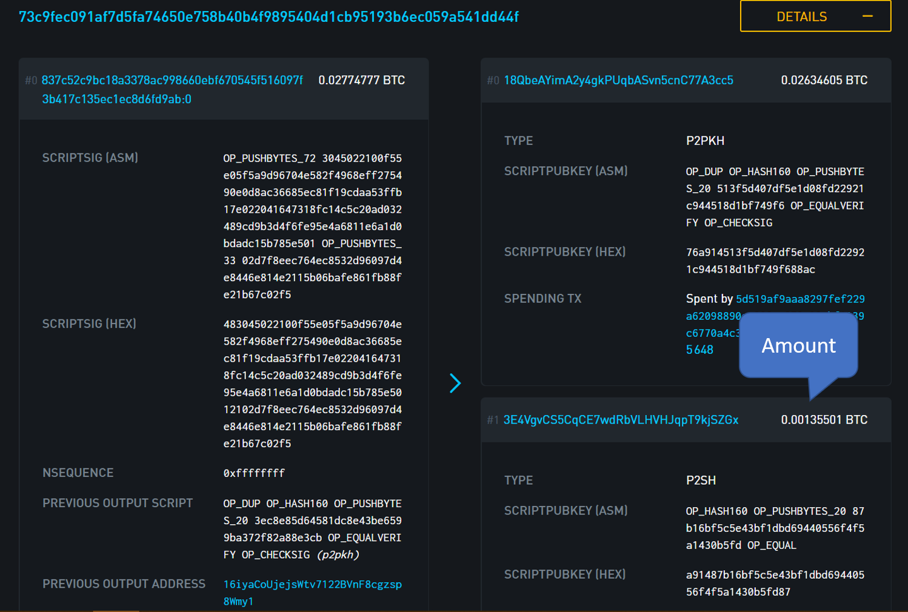
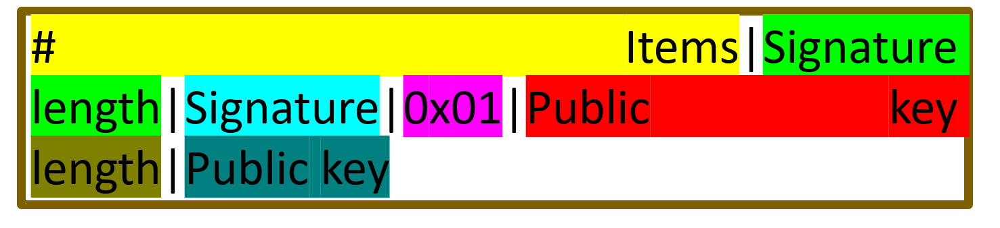

# Segwit transaction
How segwit transactions are serelized. The flowchart follows the relation between the different components in the code. 


## Double sha256:
Normally, I avoid defining any functions in my tutorials. However, in this case I'll make an exception and define a simple `dSHA256(raw)` function that takes a binary array and returns its result hashed twice (`sha256(sha256(raw))`).
This double sha process repeats itself quite extensevillasy in bitcoin's transactions and pre-defining this function will make it much more easy to follow the flowchart.

```python
import hashlib

def dSHA256(raw):
  hash_1 = hashlib.sha256(raw).digest()
  hash_2 = hashlib.sha256(hash_1).digest()
  return hash_2
```
## Keys:
For more information on Private key --> Public key --> PubKeyHash see the previous tutorial on addresses.
This code will provide us with three items that we'll later use:
1. Signing key
2. Public key
3. Hashed public key (a.k.a keyhash)

The string that we use to create the private key should be the one that controls the bitcoins we want to send.
```python
import ecdsa

private_key = bytes.fromhex("BF9795D3FCB4E2181B7B536C22470123456789EA0001397C99BA94D4D4DD62801BB151B091")
signing_key = ecdsa.SigningKey.from_string(private_key, curve=ecdsa.SECP256k1) # Don't forget to specify the curve

verifying_key = signing_key.get_verifying_key()

# Use this code block if the address you gave corresponds to the compressed public key
x_cor = bytes.fromhex(verifying_key.to_string().hex())[:32] # The first 32 bytes are the x coordinate
y_cor = bytes.fromhex(verifying_key.to_string().hex())[32:] # The last 32 bytes are the y coordinate
if int.from_bytes(y_cor, byteorder="big", signed=True) % 2 == 0: # We need to turn the y_cor into a number. 
  public_key = bytes.fromhex("02" + x_cor.hex())
else:
  public_key = bytes.fromhex("03" + x_cor.hex())


sha256_1 = hashlib.sha256(public_key)

ripemd160 = hashlib.new("ripemd160")
ripemd160.update(sha256_1.digest())

keyhash = ripemd160.digest()
```
# Bip 143
Double SHA256 of the serialization of:
  1. nVersion of the transaction (4-byte little endian)
  2. hashPrevouts (32-byte hash)
  3. hashSequence (32-byte hash)
  4. outpoint (32-byte hash + 4-byte little endian) 
  5. scriptCode of the input (serialized as scripts inside CTxOuts)
  6. value of the output spent by this input (8-byte little endian)
  7. nSequence of the input (4-byte little endian)
  8. hashOutputs (32-byte hash)
  9. nLocktime of the transaction (4-byte little endian)
  10. sighash type of the signature (4-byte little endian)

## nVersion:
According to [bitcoin's developer reference](https://bitcoin.org/en/developer-reference#raw-transaction-format) - this field should be uint32 little endian. The current version number is `1`.  
```python
version = (1).to_bytes(4, byteorder="little", signed=False)
```

## Flag:
This field is mentioned in [segwit's wallet developers reference](https://bitcoincore.org/en/segwit_wallet_dev/) - it should be equal `0x01`.
```python
flag = bytes.fromhex('01')
```

## Marker:
This field is mentioned in [segwit's wallet developers reference](https://bitcoincore.org/en/segwit_wallet_dev/) - it should be equal `0x00`.
```python
marker = bytes.fromhex('00')
```

## Prevouts -> hashPrevouts:
In this section we'll create two items:
1. Prevouts (also known as outpoint)
2. hashPrevouts

The Prevouts is a combination of the hash of the previous transaction and the index number of the output we want to spend - It basically points back to the origins of the coins that we're about to spend. This information should be available on the blockchain and you can find it using any [good blockchain explorer](https://blockstream.info/tx/73c9fec091af7d5fa74650e758b40b4f9895404d1cb95193b6ec059a541dd44f).


This information should be parsed in to ways.
1. As a simple outpoint, as defined in the [bitcoin's developer reference](https://bitcoin.org/en/developer-reference#raw-transaction-format). 
2. The `Prevouts` we've just created should be double hashed using our predefined `dSHA256(Prevouts)` to get the `hashPrevouts` that is required in the BIP - 143 list.
```python
hash = (bytes.fromhex('73c9fec091af7d5fa74650e758b40b4f9895404d1cb95193b6ec059a541dd44f'))[::-1] # Don't forget to reverse the byte order - as described in the bitcoin's developers reference.
index = (1).to_bytes(4, byteorder="little", signed=False) # 32uint little endian - as described in the bitcoin's developers reference.
Prevouts = hash + index # Also known as outpoint.
hashPrevouts = dSHA256(Prevouts)
```

## Amount:
This field is mentioned in the BIP-143 list. It's the amount of money that we've recievd as part of the prevouts (outpoint).
This information should be available on the blockchain and you can find it using any [good blockchain explorer](https://blockstream.info/tx/73c9fec091af7d5fa74650e758b40b4f9895404d1cb95193b6ec059a541dd44f).

According to 
```python
amount = (int(0.00135501 * 100000000).to_bytes(8, byteorder="little", signed=True))
```

## Sequence -> hashSequence:
In this section we'll create two items:
1. sequence
2. hashSequence

The sequence field is defined in the [bitcoin's developer reference](https://bitcoin.org/en/developer-reference#raw-transaction-format). In our case it's safe to assume that it will always be equal to `0xffffffff`. 
Once we got our sequence, we should also double hash it using our predefined `dSHA256(sequence)` function to get the hashSequence - as required in the BIP - 143 list.
```python
sequence = bytes.fromhex('ffffffff')
hashSequence = dSHA256(sequence)
```
## outpoint:
See prevouts.
```python
outpoint = prevouts
``` 

## ScriptCode:
Following the instructions on the [BIP-143 documentation](https://github.com/bitcoin/bips/blob/master/bip-0143.mediawiki) (item #5) we can see that our scriptCode should resemble a simple P2PKH scriptPubKey.
```python
scriptCode = bytes.fromhex(f'76a914{keyhash.hex()}88ac') # This is the classic P2PKH scriptPubKey
```

## nSequence:
See Sequence -> hashSequence.
```python
sequence = sequence
```

## Outputs -> hashOutputs:
Out of all the fields we need to create, this one is the less defined. This is basically the output of the transaction that you, the sender, wishes to create. It will changes according to the following data:
1. Who do you wish to send the coins to (who's the receiver)?
2. How much to you wish to send to the receiver?
3. How much fees do you wish to leave to the miners?

The `pk_script` field specify the output script. This is the script that the receiver will need to solve in order to prove that he's indeed the rightful owner of this coins.
The `pk_script_bytes` field is the size of the `pk_script`.
The `value` is the amount of coins we wish to send. Any difference between the amount of coins in the input to the coins in the output will go to the miner as a miner's fee.
These field are defined in the [bitcoin's developer reference](https://bitcoin.org/en/developer-reference#raw-transaction-format). In this case, the `pk_script` contains a script that returns the `value` to the sender. The value is 0.0013 BTC; Because the input value (`amount`) is equal to 0.00135501 BTC the reminder will go to the miner as a miner's fee (0.00135501 - 0.0013 = 0.00005501).
Finally, we need to add the size of our script and serialize the Outputs.


We'll also create the hashOutputs by double hash the `outputs` using our predefined `dSHA256(outputs)` function to get the hashOutputs - as required in the BIP - 143 list.

```python
pk_script        = bytes.fromhex('a91487b16bf5c5e43bf1dbd69440556f4f5a1430b5fd87')
pk_script_bytes  = (len(pk_script_one)).to_bytes(1, byteorder="little", signed=False)
value            = int(0.0013 * 100000000).to_bytes(8, byteorder="little", signed=True)

outputs =(
  value
  + pk_script_bytes
  + pk_script
)

hashOutputs  = dSHA256(Outputs)
```

## nLockTime:
This field is defined in the [bitcoin's developer reference](https://bitcoin.org/en/developer-reference#raw-transaction-format). In almost all cases  we'll store the number zero as an uint32 in little endians.
```python
nLockTime = (0).to_bytes(4, byteorder="little", signed=False)
```

## SigHash (also sigops):
This field changes according to the information that we're signing on.  [BIP-143 documentation](https://github.com/bitcoin/bips/blob/master/bip-0143.mediawiki) tells us to choose the SIGHASH_ALL	which corresponds to `0x01000000`
```python
sigHash = bytes.fromhex('01000000')
```

# Witnesses:
Now we'll take all of the items in the BIP-143 list to create our `pre_hash`. We'll than double hash it using our predefined `dSHA256(pre_hash)` function to get the `sig_hash`.
```python
hash_pre = (
  version
  + hashPrevouts
  + hashSequence
  + previous_output
  + (len(scriptcode).to_bytes(1, byteorder="little", signed=False))
  + scriptcode
  + amount
  + sequence
  + hashOutputs
  + nLockTime
  + hash_type
)

sig_hash = dSHA256(hash_pre)
```
The `sig_hash` variable is the one that we'll finally sign using our private key and the ecdsa library. The `sigencode = ecdsa.util.sigencode_der_canonize` parameter will provide us with a serialized result that can be used in bitcoin's transactions.

```python
signature = signing_key.sign_digest(sig_hash, sigencode = ecdsa.util.sigencode_der_canonize) # The signature is already specified in DER format!
```
Now it's time to properly serialize our `witness` variable. The first byte is the number of unique items in the witness stack. In this case we have two items:
1. The signature
2. The public key (that matches the signature).
* Each item should be have its size as a prefix.  
Between the two we'll add a separator that is defined as `0x01`. 
```python
witness = (
  (2).to_bytes(1, byteorder="little", signed=False) # Number of items
  + (len(signature) + 1).to_bytes(1, byteorder="little", signed=False) # Size of signature
  + signature # Signature
  + bytes.fromhex("01") # Separator
  + (len(public_key)).to_bytes(1, byteorder="little", signed=False) # Size of public key
  + public_key  # Public key
)
```


## Tx_in_count:
According to [bitcoin's glossary](https://bitcoin.org/en/glossary/compactsize) - this field should be a unique type of integer known as `varint` or `CompactSize`. In our case, because there's only one input that in the transaction that we're constructing, we'll use uint4 little endian.
```python
tx_in_count = (1).to_bytes(1, byteorder="little", signed=False)
```

## RedeemScript:
The redeem script as defined in the previous tutorial on keys and addresses. (In this case, we'll construct it using our own keyhash)
```python
redeemScript = bytes.fromhex(f'0014{keyhash}')
```

## Tx_Out_count:
According to [bitcoin's glossary](https://bitcoin.org/en/glossary/compactsize) - this field should be a unique type of integer known as `varint` or `CompactSize`. In our case, because there's only one output that in the transaction that we're constructing, we'll use uint4 little endian.
```python
tx_out_count = (1).to_bytes(1, byteorder="little", signed=False)
```

## FinalTx:
Just add all the variables in the right order and Voila!

```python
final_tx = (
  version
  + marker
  + flag
  + tx_in_count
  + previous_output
  + (len(redeemScript)+1).to_bytes(1, byteorder="little", signed=False)
  + (len(redeemScript)).to_bytes(1, byteorder="little", signed=False)
  + redeemScript
  + sequence
  + tx_out_count
  + tx_out
  + witness
  + nLockTime
)
```
You can now compare your segwit transaction to the following serialization.

